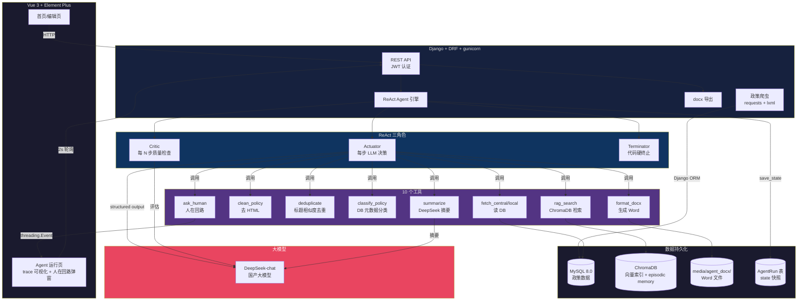

# Policy Reporter

> 基于 ReAct 范式的财税政策日报自主 Agent — 输入一个日期，Agent 自动编排工具链生成政策日报 Word 文档。


## 技术栈

| 层级 | 技术 |
|------|------|
| LLM | DeepSeek-chat |
| Agent | 自研 ReAct 框架（Actuator / Critic / Replanner / Terminator） |
| 后端 | Django 5.2 + DRF + SimpleJWT + gunicorn |
| 数据 | MySQL 8.0 + ChromaDB（向量检索） |
| 前端 | Vue 3 + Element Plus + Vite |
| 部署 | Docker Compose + Nginx |
| 测试 | pytest + pytest-cov（覆盖率 82%，179 个测试） |

## 核心能力

- **ReAct 完整循环**：Thought → Action → Observation → Thought，LLM 基于上一步工具返回结果决策
- **10 个工具动态编排**：抓取 / 清洗 / 去重 / 分类 / RAG 检索 / 摘要 / 格式化 / 人在回路
- **Critic 质量检查**：检测原地打转 / 数据为空 / 摘要质量差，触发 Replanner
- **State DB 持久化**：支持 gunicorn 多 worker，服务重启后状态不丢
- **RAG episodic memory**：跨会话经验复用，第二次运行参考历史决策
- **LLM-as-judge 评估**：format / coverage / language 三维无参考打分 + 4 组消融实验

## 架构图



## 快速开始

```bash
# 1. 克隆项目
git clone https://github.com/shirleyyshi/policy_reporter.git
cd policy_reporter

# 2. 配置环境变量
cp .env.example .env
# 编辑 .env 填入 SECRET_KEY / DB_ROOT_PASSWORD / DEEPSEEK_API_KEY

# 3. 启动
docker-compose up -d --build

# 4. 创建超级用户 + 爬数据
docker-compose exec backend python manage.py createsuperuser
docker-compose exec backend python manage.py crawl_policies --all
docker-compose exec backend python manage.py build_index

# 5. 访问 http://localhost
```

## 运行测试

```bash
cd backend
pip install -r requirements-dev.txt
pytest --cov=apps --cov-report=term-missing
```

## 消融实验（Ablation）

4 组配置 × 4 场景 = 16 次 Agent 运行，验证每个组件的贡献度：

| 配置 | 成功率 | 平均步数 | Critic 触发 | 建议重规划率 | LLM-judge | 耗时 |
|------|--------|----------|-------------|---------------|-----------|------|
| **baseline**（全开） | **75.0%** | 12.2 | 4.5 | 56.6% | **5.0** | 19.6s |
| no_critic（关 Critic） | **25.0%** | 11.0 | 0.8 | 100.0% | 3.0 | 12.6s |
| no_replanner（关 Replanner） | 75.0% | 10.8 | 3.5 | 76.2% | 4.0 | 17.2s |
| no_stall（关停滞检测） | 75.0% | 10.2 | 2.8 | 75.0% | 4.0 | 15.9s |

**关键结论**：
- **Critic 是核心组件**：关掉后成功率从 75% 暴跌到 25%，LLM-judge 从 5.0 降到 3.0
- **Critic 必须配套 Replanner**：no_replanner 配置下 Critic 仍触发 3.5 次，建议重规划率从 56.6% 升到 76.2%（Critic 诊断后 Replanner 才能把建议转化为改进行动）
- **停滞检测节省步数**：no_stall 平均 10.2 步 vs baseline 12.2 步，但成功率不变（停滞检测主要避免浪费步数，不影响最终质量）

> 指标命名说明：表中"建议重规划率"衡量 Critic 提出重规划建议的比例（曾称"修复率"，已更名——建议不等于修复，更名让指标含义与统计口径一致）。

## 项目结构

```
├── backend/                # Django 后端
│   ├── apps/
│   │   ├── agent/          # ReAct Agent 引擎
│   │   │   ├── core.py     # 主循环（Actuator/Critic/Terminator）
│   │   │   ├── tools.py    # 10 个工具
│   │   │   ├── rag.py      # ChromaDB 向量检索 + episodic memory
│   │   │   ├── prompts.py  # LLM prompt 构造
│   │   │   ├── eval/       # 消融实验 + LLM-as-judge
│   │   │   └── test_*.py   # 单元测试
│   │   └── report/         # 政策 CRUD + 爬虫 + docx 导出
│   ├── config/             # Django settings
│   ├── conftest.py         # pytest 共享 fixtures
│   └── pytest.ini          # pytest 配置
├── frontend/               # Vue 3 前端
│   └── src/views/          # 登录/首页/编辑页/Agent 运行页
├── .github/workflows/      # GitHub Actions CI
├── docker-compose.yml      # 三容器编排（db + backend + frontend）
└── scripts/                # 爬虫定时脚本
```
